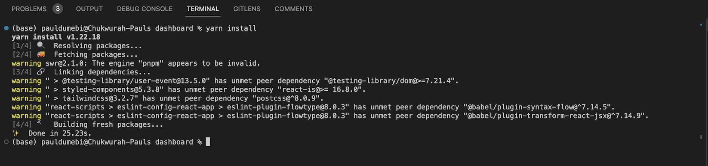
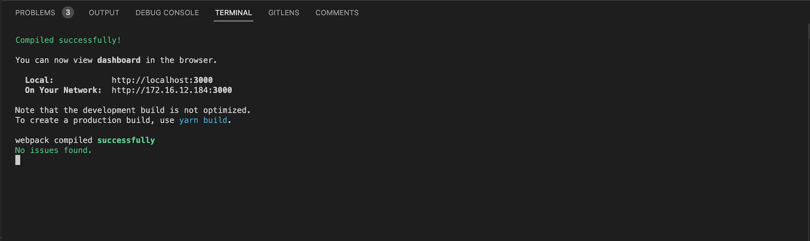
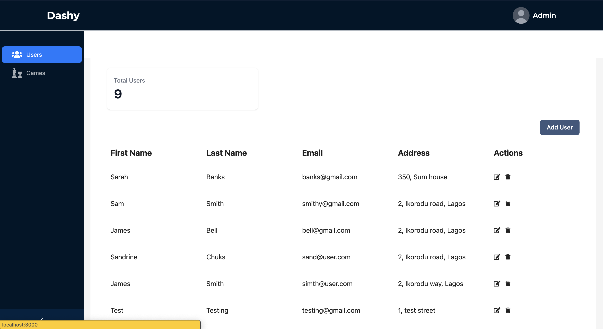

# Introduction
This test was done using React Framework and some libraries some of which include tailwind, typescript, Antd, react-hook-form, swr, use-state-with-callback. A comprehensive
list of this libraries are in the package.json file.

# Folder Structure

📦dashboard
 ┣ 📂public
 ┃ ┣ 📂images
 ┃ ┃ ┗ 📜interface.png
 ┃ ┃ ┗ 📜installation.png
 ┃ ┃ ┗ 📜start-app.png
 ┃ ┣ 📜favicon.ico
 ┃ ┣ 📜index.html
 ┃ ┣ 📜logo192.png
 ┃ ┣ 📜logo512.png
 ┃ ┣ 📜manifest.json
 ┃ ┗ 📜robots.txt
 ┣ 📂src
 ┃ ┣ 📂components
 ┃ ┃ ┣ 📂custom-select
 ┃ ┃ ┃ ┗ 📜index.tsx
 ┃ ┃ ┣ 📂custom-spinner
 ┃ ┃ ┃ ┗ 📜index.tsx
 ┃ ┃ ┣ 📂modals
 ┃ ┃ ┃ ┣ 📜add-game.tsx
 ┃ ┃ ┃ ┣ 📜add-user.tsx
 ┃ ┃ ┃ ┣ 📜confirm-delete.tsx
 ┃ ┃ ┃ ┣ 📜edit-game.tsx
 ┃ ┃ ┃ ┣ 📜edit-user.tsx
 ┃ ┃ ┃ ┗ 📜index.tsx
 ┃ ┃ ┣ 📂navbar
 ┃ ┃ ┃ ┗ 📜index.tsx
 ┃ ┃ ┣ 📂not-found
 ┃ ┃ ┃ ┗ 📜index.tsx
 ┃ ┃ ┣ 📂side-menu
 ┃ ┃ ┃ ┣ 📜index.tsx
 ┃ ┃ ┃ ┗ 📜nav-items.tsx
 ┃ ┃ ┗ 📂summary
 ┃ ┃ ┃ ┗ 📜index.tsx
 ┃ ┣ 📂hooks
 ┃ ┃ ┗ 📜use-axios.ts
 ┃ ┣ 📂pages
 ┃ ┃ ┣ 📜games.tsx
 ┃ ┃ ┣ 📜home.tsx
 ┃ ┃ ┣ 📜index.tsx
 ┃ ┃ ┗ 📜users.tsx
 ┃ ┣ 📂services
 ┃ ┃ ┣ 📂axios
 ┃ ┃ ┃ ┣ 📜game.ts
 ┃ ┃ ┃ ┣ 📜urls.ts
 ┃ ┃ ┃ ┗ 📜user.ts
 ┃ ┃ ┗ 📂swr
 ┃ ┃ ┃ ┣ 📜game.ts
 ┃ ┃ ┃ ┗ 📜user.ts
 ┃ ┣ 📂types
 ┃ ┃ ┣ 📜modal-state.ts
 ┃ ┃ ┣ 📜nav-item.ts
 ┃ ┃ ┗ 📜user-form.ts
 ┃ ┣ 📂utils
 ┃ ┃ ┗ 📜showToast.ts
 ┃ ┣ 📜App.tsx
 ┃ ┣ 📜index.css
 ┃ ┣ 📜index.tsx
 ┃ ┗ 📜routes.tsx
 ┣ 📜.gitignore
 ┣ 📜.prettierrc
 ┣ 📜README.md
 ┣ 📜package.json
 ┣ 📜tailwind.config.js
 ┣ 📜tsconfig.json
 ┣ 📜yarn-error.log
 ┗ 📜yarn.lock

# Installation

This project was developed using a number of `React packages`, all of which must be installed before the project can run. The versions of the packages must match the ones used during the project's development as using a different version may result in unexpected behaviours. 

`Steps`

# Cloning

1. On GitHub.com, navigate to the main page of the repository.
2. Above the list of files, click Code.
3. Copy the URL for the repository using HTTPS or SSH Key.
4. Open Terminal and Change the current working directory to the location where you want the cloned directory.
5. Type git clone, and then paste the URL you copied earlier. **SSH** `git clone git@github.com:Pauldumebi/Bombay.git` or **HTTPS** `https://github.com/Pauldumebi/Bombay.git`

Read more: `https://docs.github.com/en/repositories/creating-and-managing-repositories/cloning-a-repository`

# Installation and Starting app

1. Open up the project folder in Vs code or any preferred IDE of use.
2. To install all packages used for this project open up terminal in your IDE and type the following command `yarn install` 
3. After successful installation start up the project using `yarn start` 
4. Ctrl + Click on the link or ( Cmd + Click **Mac** ) shown in terminal after it has successfully compiled to view on the browser 